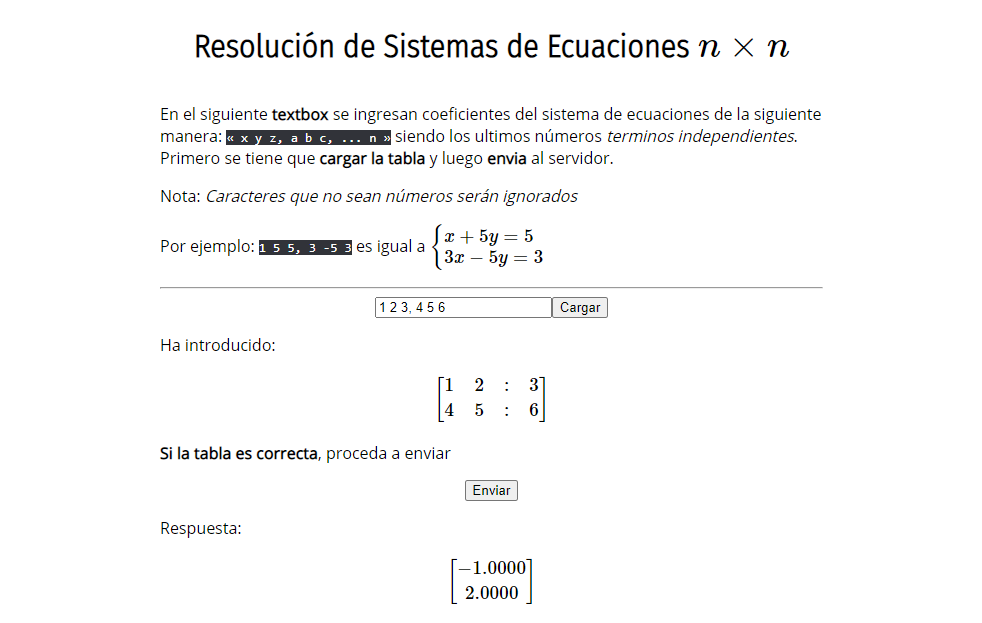
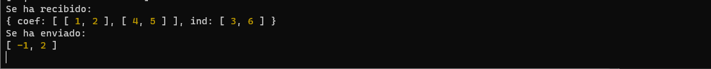

# ResolucionSistemasEcuaciones

Realizado para un proyecto de `Programación Web`.

## Intrucciones

Solo ingrese las ecuaciones de la siguiente manera `x y z, a b c, ...`, los números van a indicar los *coeficientes de las ecuaciones*. La `coma` va a ser el separador de las ecuaciones y último número del mismo va a ser el *término independiente*.

Tal vez luego, cuando aprenda un poco más de CSS y frameworks lo haga más bonito. 😁